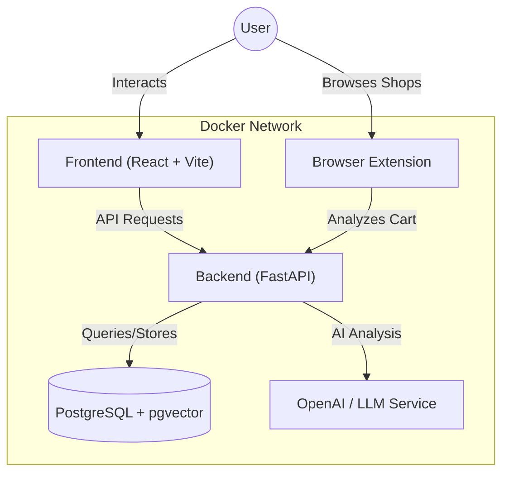

# Penny - Your AI Financial Companion

Penny is a comprehensive financial tracking application designed to help users understand the "true cost" of their purchases. It combines a modern web dashboard with a browser extension to provide real-time insights, receipt analysis, and gamified financial goals. By leveraging AI, Penny transforms raw transaction data into actionable financial wisdom.

## Table of Contents

- [Overview](#overview)
- [Architecture](#architecture)
- [Features](#features)
- [Tech Stack](#tech-stack)
- [Prerequisites](#prerequisites)
- [Getting Started](#getting-started)
- [Usage](#usage)
- [Project Structure](#project-structure)
- [Contributing](#contributing)

## Overview

Penny goes beyond simple expense tracking. It introduces the concept of a "Financial Twin" and "Future You" to visualize the long-term impact of spending habits. With integrated receipt scanning and shopping cart analysis, Penny helps users make smarter decisions *before* and *after* they buy.

## Architecture

The project follows a modern microservices-inspired architecture, containerized with Docker.



## Features

### Frontend Dashboard
- **Financial Breakdown**: Visualize income, expenses, and savings with interactive charts.
- **Goal Tracking**: Set financial goals and track progress with gamified XP and badges.
- **Receipt Analysis**: Upload receipts for automatic line-item extraction and categorization.
- **Financial Twin**: Simulate future financial scenarios based on current habits.
- **Gamification**: Earn achievements like "Savings Streak" or "Budget Master."

### Backend API
- **AI-Powered Analysis**: Uses LangChain and OpenAI to interpret receipts and shopping carts.
- **Vector Search**: Utilizes `pgvector` for semantic search across transaction data.
- **Robust API**: Built with FastAPI for high performance and automatic documentation.
- **Secure Authentication**: User management and security handled via `fastapi-users`.

### Browser Extension
- **Real-time Insights**: Analyzes shopping carts on supported sites to show the "true cost" (e.g., "This item equals 2 hours of work").
- **Companion Mode**: Penny mascot provides helpful tips and warnings while browsing.

## Tech Stack

| Component | Technology |
|-----------|------------|
| **Frontend** | React, TypeScript, Vite, Tailwind CSS, Shadcn UI, Recharts |
| **Backend** | Python 3.14+, FastAPI, SQLModel, AsyncPG, LangChain |
| **Database** | PostgreSQL 17 with `pgvector` extension |
| **Extension** | Chrome Manifest V3, JavaScript |
| **DevOps** | Docker, Docker Compose, Makefile |

## Prerequisites

Before running the project, ensure you have the following installed:

- [Docker Desktop](https://www.docker.com/products/docker-desktop/)
- [Make](https://www.gnu.org/software/make/) (usually pre-installed on macOS/Linux)
- [Git](https://git-scm.com/)

## Getting Started

1.  **Clone the repository**:
    ```bash
    git clone https://github.com/your-username/penny.git
    cd penny
    ```

2.  **Configure Environment Variables**:
    Create `.env.dev` and `.env.prod` files from the examples.
    ```bash
    cp .env.dev.example .env.dev
    cp .env.prod.example .env.prod
    ```
    *Note: You will need to add your OpenAI API key to `.env.dev` for AI features to work.*

3.  **Start the Development Environment**:
    Use the provided Makefile to spin up the containers.
    ```bash
    make dev
    ```
    This command builds the images and starts the services in detached mode with hot-reloading enabled.

4.  **Verify Installation**:
    - **Frontend**: Visit [http://localhost:5173](http://localhost:5173)
    - **Backend API**: Visit [http://localhost:8000/docs](http://localhost:8000/docs)
    - **Database**: Port `5432` is exposed for local connection tools.

## Usage

### Managing the Application
The `Makefile` provides several helper commands:

- `make dev-logs`: View logs for all services.
- `make dev-stop`: Stop the containers.
- `make dev-down`: Stop and remove containers/volumes.
- `make prune`: Clean up Docker system.
- `make help`: List all available commands.

### Installing the Browser Extension
1.  Open Chrome and navigate to `chrome://extensions/`.
2.  Enable "Developer mode" in the top right.
3.  Click "Load unpacked".
4.  Select the `extension` folder in this project directory.

## Project Structure

```
penny/
├── backend/            # FastAPI application
│   ├── app/            # Main application logic
│   ├── Dockerfile      # Backend container config
│   └── pyproject.toml  # Python dependencies
├── frontend/           # React application
│   ├── src/            # Source code (Components, Pages, Hooks)
│   ├── Dockerfile      # Frontend container config
│   └── package.json    # Node dependencies
├── extension/          # Chrome extension files
├── docker-compose.*    # Docker composition files
├── Makefile            # Automation commands
└── .env.*              # Environment configuration
```

## Contributing

Contributions are welcome! Please follow these steps:
1.  Fork the repository.
2.  Create a feature branch (`git checkout -b feature/AmazingFeature`).
3.  Commit your changes (`git commit -m 'Add some AmazingFeature'`).
4.  Push to the branch (`git push origin feature/AmazingFeature`).
5.  Open a Pull Request.
